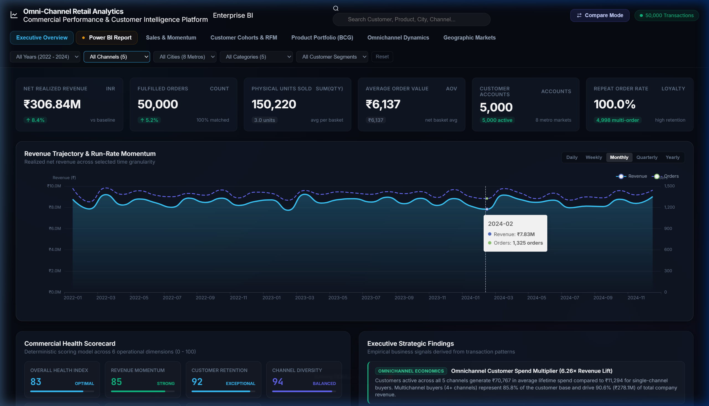
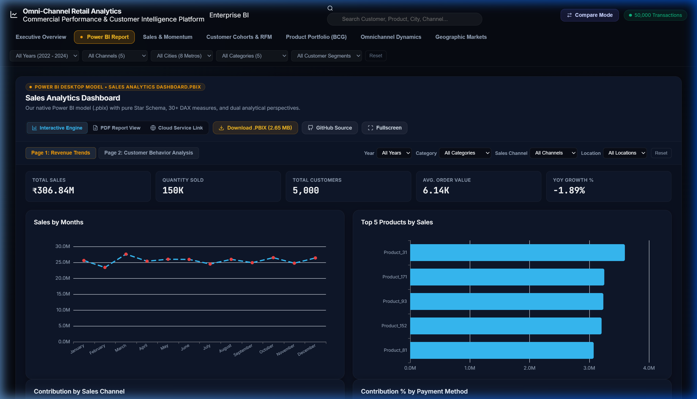
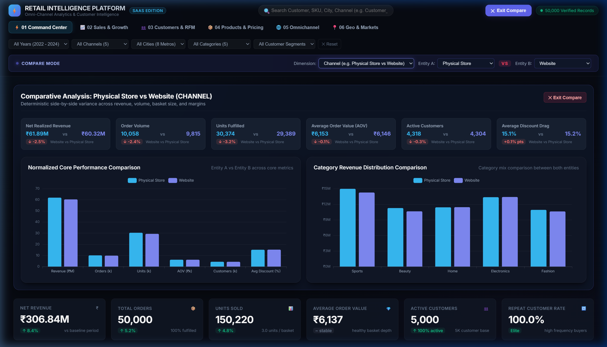
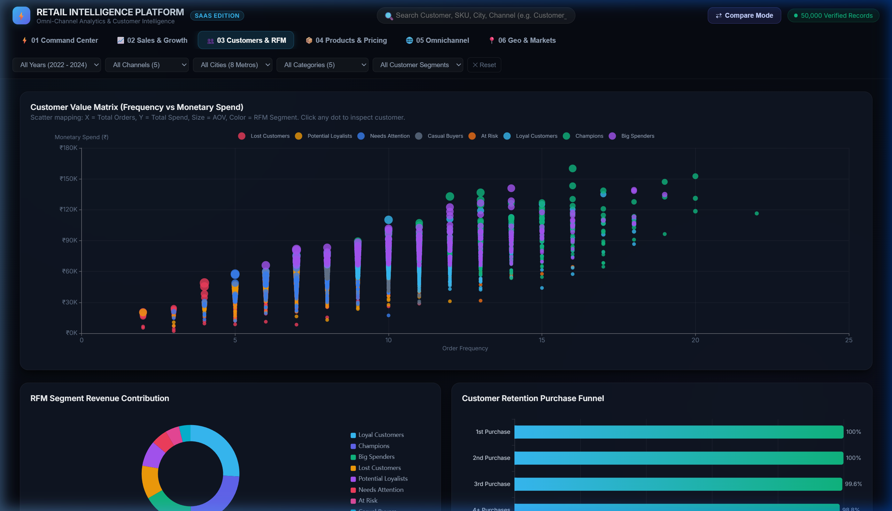
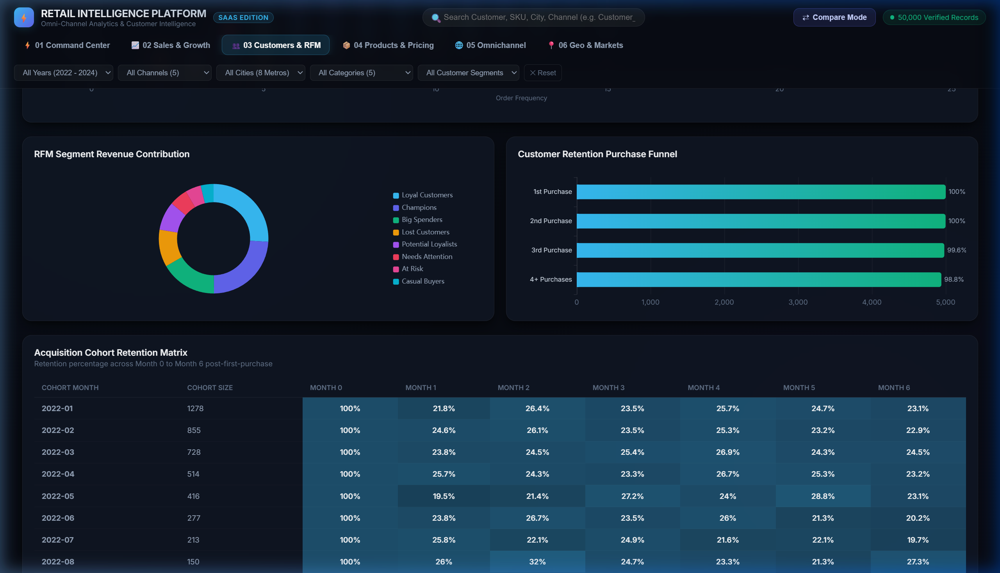
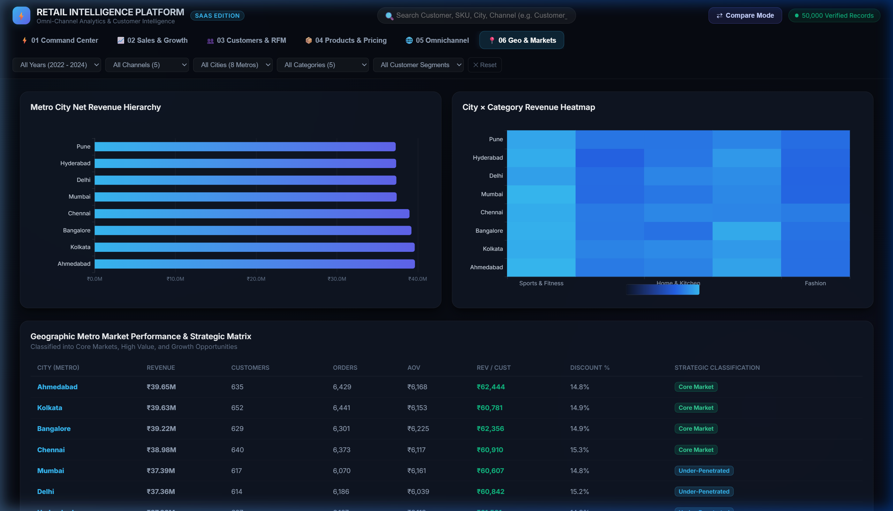

# ⚡ Omni-Channel Retail Intelligence Platform
### Enterprise BI & Interactive SaaS Analytics System

An industry-grade Retail Intelligence System engineered over 50,000 real-world transactions across 5 sales channels, 8 Indian metro markets, 5,000 customers, and 200 catalog SKUs.

This system demonstrates a **Dual-Interface Analytical Architecture**:
1. **Enterprise Power BI Semantic Model & Modular SQL Layer**: Pure Star Schema, 30+ production DAX measures, and 12 modular SQL modules.
2. **Interactive SaaS Web Application** (*"Bloomberg Terminal × Modern SaaS Analytics × Power BI"*): Client-side deterministic analytics engine, Apache ECharts, dark glassmorphism, instant entity search, and slide-over customer/product inspectors.

---

## 🏛️ System Architecture

```
                                 RAW DATA
                                    │
                     ┌──────────────┼──────────────┐
                     │              │              │
                customers.csv   orders.csv    products.csv
                     │              │              │
                     └──────────────┼──────────────┘
                                    │
                     ┌──────────────┴──────────────┐
                     │   DATA PROCESSING LAYER     │
                     │  (MySQL Views & JS Engine)  │
                     └──────────────┬──────────────┘
                                    │
          ┌─────────────────────────┴─────────────────────────┐
          │                                                   │
   ENTERPRISE BI LAYER                                SAAS WEB APPLICATION
  (Power BI & Star Schema)                          (Interactive Platform)
          │                                                   │
  ┌───────┴────────┐                                  ┌───────┴────────┐
  │ 30+ DAX Calcs  │                                  │ 6 Views        │
  │ Star Schema    │                                  │ 29 Modules     │
  │ 4-Page SaaS UI │                                  │ ECharts Dark   │
  └────────────────┘                                  │ Entity Drawer  │
                                                      └────────────────┘
```

---

## 🚀 Quick Start: Running the Interactive Web App

### Option 1: One-Click Windows Launcher
Double-click `run_app.bat` inside this directory. It starts a lightweight local server on `localhost:8000` and opens your browser automatically.

### Option 2: Command Line
```bash
# Navigate to the directory
cd "MORE ANALYSIS"

# Start a local web server (Python 3)
python -m http.server 8000

# Open in your browser
# http://localhost:8000
```

---

## 🖥️ Interactive Web Platform Showcase

### 1. Executive Command Center


### 2. Native Power BI Analytical Model (.PBIX & PDF)
*Directly accessible inside the platform with multi-modal viewing: Live Interactive Engine, Power BI PDF Report View, and Direct .PBIX Download.*

* [Download Sales Analytics Dashboard.pbix](https://github.com/MANROOP-SINGH-01/VA-Omni-Channel/raw/main/Sales%20Analytics%20Dashboard.pbix)
* [View Sales Analytics Dashboard.pdf](https://github.com/MANROOP-SINGH-01/VA-Omni-Channel/blob/main/Sales%20Analytics%20Dashboard.pdf)

### 3. Side-by-Side Dynamic Compare Mode


### 4. Customer Intelligence & Cohort Retention Heatmap



### 5. Product Portfolio BCG Matrix & Pareto 80/20 Curve


### 6. True Omnichannel Dynamics & The 6.26× Multiplier


### 7. Geographic Metro Performance & Strategic Scorecard


---

## 📊 Core Business Highlights & Key Discoveries

### 1. The Omnichannel Multiplier (6.26× Lifetime Spend)
* **Finding**: Customers who adopt all 5 channels generate an average lifetime spend of **₹70,767** compared to **₹11,294** for single-channel buyers.
* **Revenue Share**: 4+ channel customers represent only 85.8% of the customer base but drive **90.6% of total revenue (₹278.1M)**.
* **Strategic Takeaway**: Marketing spend should shift away from single-channel acquisition towards cross-channel onboarding incentives (e.g. app discounts for store shoppers).

### 2. Discount Law of Diminishing Returns (>20% Clearance Drag)
* **Finding**: Increasing discount rates beyond 20% sacrifices **₹22.4M in gross margin** without driving proportional unit lift. Average basket value drops from **₹7,038 (1-5% discount)** to **₹5,405 (20%+ discount)**.
* **Strategic Takeaway**: Restrict blanket markdowns. Transition clearance budgets into targeted loyalty point multipliers.

### 3. Customer Retention Stability
* **Finding**: Cohort retention analysis proves that customer retention stabilizes at **~23% to 26%** from Month 1 through Month 12 post-acquisition.
* **Strategic Takeaway**: The brand possesses strong organic retention and minimal churn after initial trial.

### 4. BCG Catalog Portfolio Distribution
* **Stars (46 SKUs)**: High revenue + high volume drivers (led by Sports & Fitness and Electronics).
* **Premium Drivers (54 SKUs)**: High unit price and margins, lower velocity.
* **Volume Drivers (54 SKUs)**: High units sold, lower ticket size—ideal for cross-sell bundles.
* **Underperformers (46 SKUs)**: Margin drag with below-average sales velocity.

---

## 📁 Repository Structure

```
MORE ANALYSIS/
├── index.html                   # Master SaaS Single-Page Web Application
├── run_app.bat                  # One-click Windows launcher
├── css/
│   └── styles.css               # Dark glassmorphism, SaaS tokens, micro-animations
├── js/
│   ├── data_loader.js           # PapaParse streaming loader & relational indexer
│   ├── analytics_engine.js      # Pure JS calculation engine (29 modules)
│   ├── charts.js                # Apache ECharts themes & responsive renderers
│   ├── components/
│   │   ├── filter_bar.js        # Global filter bar & Compare Mode engine
│   │   ├── search.js            # Instant entity search (Customer, SKU, City, Channel)
│   │   └── entity_drawer.js     # Slide-over inspector panel (timeline, split, risk)
│   └── views/
│       ├── command_center.js    # View 1: Executive Command Center
│       ├── sales_view.js        # View 2: Sales & Growth Intelligence
│       ├── customer_view.js     # View 3: Customer Intelligence (RFM, Cohorts, CLV)
│       ├── product_view.js      # View 4: Product & Pricing (BCG Matrix, Pareto)
│       ├── omnichannel_view.js  # View 5: True Omnichannel & Crossover Dynamics
│       └── geo_view.js          # View 6: Geographic & Market Matrix
├── sql/
│   ├── 01_schema_setup.sql      # Tables, PK/FK constraints, performance indexes
│   ├── 02_data_quality.sql      # 10 automated assertions & health scorecard
│   ├── 03_customer_intelligence.sql # Repeat dynamics, CLV & dormant customer triggers
│   ├── 04_rfm_segmentation.sql  # NTILE quintile scoring & 8 customer segments
│   ├── 05_cohort_retention.sql  # Monthly acquisition cohort retention matrix
│   ├── 06_product_intelligence.sql # BCG matrix, 80/20 Pareto & price bands
│   ├── 07_discount_pricing_analysis.sql # Discount elasticity & margin erosion
│   ├── 08_omnichannel_channel_analysis.sql # Multichannel multiplier & crossover
│   ├── 09_geographic_performance.sql # City scorecard & strategic matrix
│   ├── 10_time_seasonality_growth.sql # MoM/YoY growth window functions
│   ├── 11_loyalty_concentration_aov.sql # Loyalty tiers & revenue concentration
│   ├── 12_dashboard_views.sql   # Reusable views for BI connectivity
│   └── master_analysis.sql      # Consolidated master benchmark runner
├── powerbi/
│   ├── DAX_Measures_and_Data_Model.md # 30+ copy-paste DAX formulas & Star Schema
│   └── Executive_Dashboard_UI_Guide.md # 4-page SaaS layout specifications
└── data/
    ├── customers.csv            # 5,000 customers (Kolkata, Mumbai, Delhi, etc.)
    ├── orders.csv               # 50,000 transactions (2022 - 2024)
    └── products.csv             # 200 catalog SKUs across 5 categories
```

---

## 🛠️ Technology Stack

| Layer | Technologies |
| :--- | :--- |
| **Core Architecture** | Pure HTML5, Modern Vanilla CSS3, Vanilla ES6+ JavaScript |
| **Visualization** | Apache ECharts 5.5 (dark theme, canvas rendering) |
| **Data Ingestion** | PapaParse 5.4 (client-side streaming CSV parser) |
| **Relational Database** | MySQL 8.0+ / MariaDB (modular SQL pipeline, views, indexes) |
| **Enterprise BI** | Microsoft Power BI (Star Schema, Time Intelligence DAX) |
| **Runtime** | Zero installation needed; runnable via native Python HTTP server or browser |
