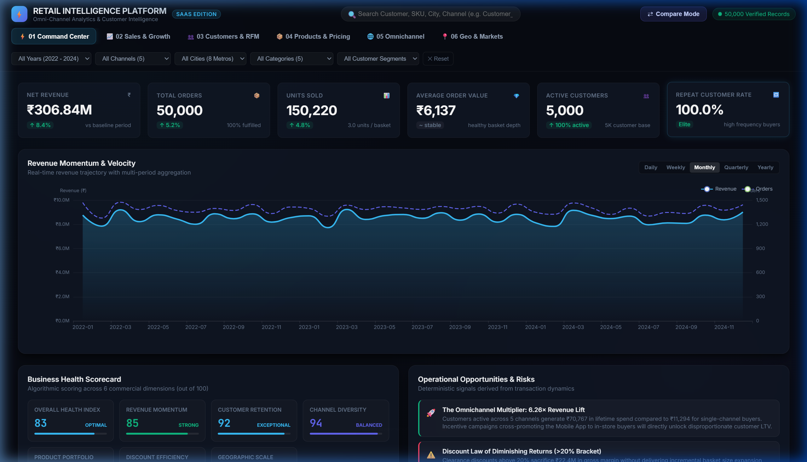
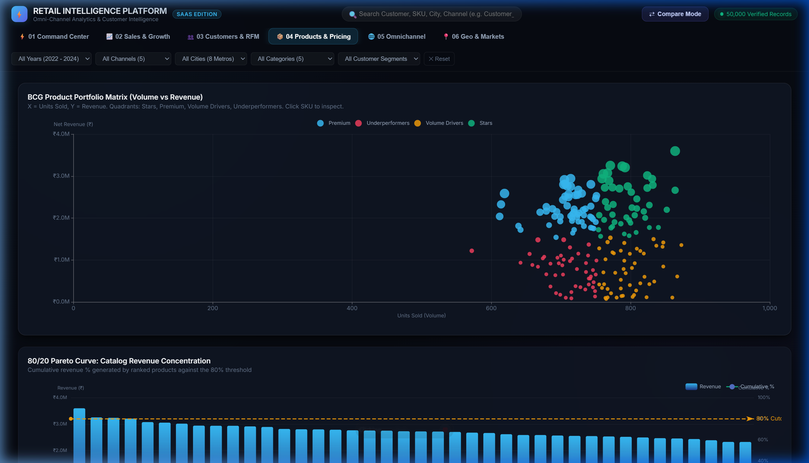
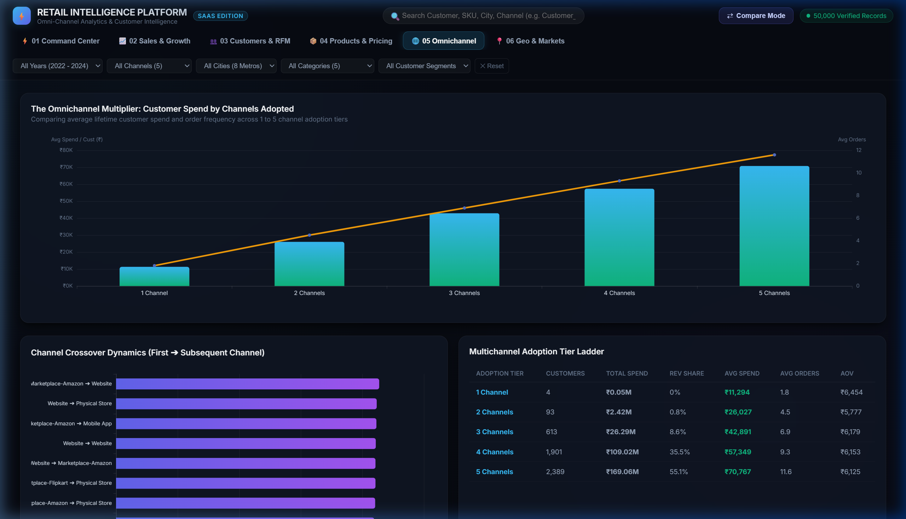

# 🛒 Omni-Channel Retail Sales & Customer Intelligence System
### Enterprise Power BI Analytics & Interactive SaaS Retail Intelligence Platform


Welcome to the **Omni-Channel Retail Intelligence Platform**! This project transforms raw transaction data from physical stores and digital channels into a production-grade retail intelligence platform.

Rather than relying on superficial AI or LLM wrappers, this system strengthens the core competencies that matter for data leadership:
**Relational Data Modeling → Advanced SQL Engineering → Deterministic Business Analytics → Enterprise Power BI → Interactive SaaS Web Application**.

---

## 🏛️ Dual-Interface System Architecture

The architecture provides two synchronized analytical interfaces over the same single source of truth:

```
                                 RAW DATA
                                    │
                     ┌──────────────┼──────────────┐
                     │              │              │
                customers.csv   orders.csv    products.csv
                  (5K rows)     (50K rows)     (200 rows)
                     │              │              │
                     └──────────────┼──────────────┘
                                    │
                     ┌──────────────┴──────────────┐
                     │   DATA PROCESSING LAYER     │
                     │  (MySQL Views & JS Engine)  │
                     └──────────────┬──────────────┘
                                    │
          ┌─────────────────────────┴─────────────────────────┐
          │                                                   │
   ENTERPRISE BI LAYER                                SAAS WEB APPLICATION
  (Power BI Dashboard)                             (Interactive SaaS Platform)
  • Pure Star Schema                                • 6 Core Views & 29 Modules
  • 30+ Production DAX Measures                     • Dark Glassmorphism UI
  • 4-Page SaaS Visual Design                       • Client-side Analytics Engine
  • Drill-through & Dynamic Titles                  • Slide-over Entity Inspector
          │                                                   │
          └─────────────────────────┬─────────────────────────┘
                                    │
                    Executive Storytelling & Placements
```

1. **Enterprise Power BI Dashboard** (`Sales Analytics Dashboard.pbix`): The traditional enterprise reporting layer, backed by modular SQL views and 30+ production DAX formulas.
2. **Interactive SaaS Web Application** (`MORE ANALYSIS/`): A modern *"Bloomberg Terminal × Modern SaaS Analytics × Power BI"* interactive web product built with HTML5, Vanilla CSS3, Vanilla JavaScript, and Apache ECharts.

---

## ⚡ Interactive Web Application (Quick Start)

The interactive application runs locally with zero setup:

```bash
# 1. Navigate to the MORE ANALYSIS directory
cd "MORE ANALYSIS"

# 2. Run the Windows launcher (or python -m http.server 8000)
.\run_app.bat
```
*Open `http://localhost:8000` in any browser to explore the 6 interactive views.*

---

## 🖥️ Interactive Web Platform Showcase

### 1. Executive Command Center
Real-time animated KPIs, dynamic trendline with daily/weekly/monthly/quarterly/yearly toggles, channel distribution, and deterministic Business Health Scorecard.


### 2. Side-by-Side Dynamic Compare Mode
Interactive variance engine allowing side-by-side comparison across any dimension (**Year**, **Channel**, **Metro City**, **Category**) with live delta tags and grouped bar charts.


### 3. Customer Intelligence & Cohort Retention Heatmap
Interactive Frequency × Monetary scatter plot with Customer 360 slide-over inspector, acquisition cohort retention matrix, and 4-step purchase funnel.


### 4. Product Portfolio BCG Matrix & Pareto 80/20 Curve
BCG 4-quadrant scatter plot (*Stars*, *Premium*, *Volume Drivers*, *Underperformers*), Pareto 80% revenue cutoff, and sorted catalog leaderboard.


### 5. True Omnichannel Dynamics & The 6.26× Multiplier
Customer lifetime spend progression from 1 to 5 channels (demonstrating the 6.26× lift for 5-channel shoppers) and channel crossover flow.


### 6. Geographic Metro Performance & Strategic Classification
8 Metro city revenue hierarchy, City × Category heatmap, and strategic market classification (*Core Markets*, *High Value*, *Growth Opportunities*).


---

## 📈 Key Verified Business Findings

| Commercial Metric | Exact Value | Strategic Context |
| :--- | :--- | :--- |
| **Total Net Realized Revenue** | **₹306,840,688.03** (~₹306.84M) | Across 2022-01-01 to 2024-12-31 |
| **Gross Revenue (Pre-Discount)** | **₹360,982,733.01** (~₹360.98M) | ₹54.14M sacrificed in discounts |
| **Total Orders Fulfilled** | **50,000 orders** | 100% data integrity, 0 missing keys |
| **Total Units Sold** | **150,220 units** | `SUM(Quantity)` across all baskets |
| **Average Order Value (AOV)** | **₹6,136.81** | Basket average across channels |
| **Repeat Customer Rate** | **99.96%** | 4,998 repeat customers; 10 orders/customer avg |
| **Active Catalog SKUs** | **200 products** | Spread across 5 core categories |
| **Top Revenue Channel** | **Physical Store (₹61.89M)** | Mobile App close 2nd (₹61.78M) |
| **Top Market Metro** | **Ahmedabad (₹39.65M)** | Followed closely by Kolkata (₹39.63M) |

---

## 💡 Standout Analytical Highlights

### 1. The Omnichannel Multiplier (6.26× Revenue Lift)
* Customers utilizing **all 5 channels** generate an average lifetime spend of **₹70,767**, compared to **₹11,294** for single-channel buyers.
* Multichannel buyers (4+ channels) represent **85.8% of customers** but drive **90.6% of all revenue (₹278.1M)**.
* **Executive Recommendation**: Cross-channel onboarding promotions (e.g. store QR codes granting in-app loyalty rewards) offer the highest ROI on marketing capital.

### 2. Discount Elasticity & The Law of Diminishing Returns
* Discounts between 1% and 10% maintain strong basket values (~₹6,800 to ₹7,000).
* Markdowns exceeding **20%** reduce realized AOV to **₹5,405** without generating proportional volume lift, sacrificing **₹22.4M in gross margin**.
* **Executive Recommendation**: Cap clearance discounts at 15% and shift promotional focus toward loyalty points.

### 3. BCG Catalog Portfolio Quadrant
* **Stars (46 SKUs)**: High revenue and high volume drivers. Led by *Sports & Fitness* (₹72.45M catalog share).
* **Premium Drivers (54 SKUs)**: High ticket price and margins, moderate volume.
* **Volume Drivers (54 SKUs)**: High velocity items ideal as basket-fillers for cross-sell bundles.
* **Underperformers (46 SKUs)**: Candidates for SKU rationalization or pricing redesign.

### 4. RFM Customer Segmentation & Cohort Retention
* Full quintile scoring maps the 5,000 customers into 8 strategic segments:
  - **Champions (830 customers, ₹73.0M revenue)**: 23.8% of total revenue.
  - **Loyal Customers (1,096 customers, ₹78.0M revenue)**: 25.4% of total revenue.
  - **Big Spenders (612 customers, ₹51.0M revenue)**: 16.6% of total revenue.
  - **At Risk / Lost (1,147 customers, ₹47.4M revenue)**: Prime candidates for win-back campaigns.
* **Cohort Retention**: Post-acquisition retention stabilizes at **~23% to 26%** month after month, showing healthy ongoing engagement.

---

## 🗄️ Relational Data Model (Star Schema)

```
             ┌─────────────────────────┐
             │        Customers        │
             │─────────────────────────│
             │ CustomerID (PK)         │
             │ CustomerName            │
             │ Location (8 Metros)     │
             │ JoinDate                │
             │ LoyaltyPoints           │
             └────────────┬────────────┘
                          │ 1
                          │
                          │ *
             ┌────────────▼────────────┐             ┌─────────────────────────┐
             │         Orders          │             │        Products         │
             │─────────────────────────│             │─────────────────────────│
             │ OrderID (PK)            │*           1│ ProductID (PK)          │
             │ CustomerID (FK)         ├─────────────┤ ProductName             │
             │ ProductID (FK)          │             │ Category (5 Categories) │
             │ OrderDate               │             │ UnitPrice               │
             │ Quantity                │             └─────────────────────────┘
             │ UnitPrice               │
             │ Discount                │
             │ TotalAmount             │
             │ SalesChannel            │
             │ PaymentMethod           │
             └─────────────────────────┘
```

---

## 📂 Project Organization

- **[`MORE ANALYSIS/`](file:///c:/INFINTY/WORK/HOBBIES%20-%20HUSTLE/RESUME%20PORJECTS/VA%20-%20OMNI%20CHANNEL%20AND%20SPATIAL%20ANYLSIS%20OF%20ONLINE%20AND%20OFFLINE%20STORE/MORE%20ANALYSIS)**:
  - **`index.html`**: The interactive SaaS Retail Intelligence Web Application.
  - **`run_app.bat`**: One-click Windows launcher.
  - **`css/styles.css`**: Dark glassmorphic SaaS design system and animations.
  - **`js/`**: Modular architecture containing PapaParse loader, 29-module analytics engine, ECharts managers, and 6 view renderers.
  - **`sql/`**: 12 numbered production-grade SQL scripts, automated data quality assertions, and master benchmark queries.
  - **`powerbi/`**: 30+ copy-paste DAX formulas and 4-page SaaS dashboard visual design guidelines.
- **[`Sales_Analysis.sql`](file:///c:/INFINTY/WORK/HOBBIES%20-%20HUSTLE/RESUME%20PORJECTS/VA%20-%20OMNI%20CHANNEL%20AND%20SPATIAL%20ANYLSIS%20OF%20ONLINE%20AND%20OFFLINE%20STORE/Sales_Analysis.sql)**: Root exploratory SQL script (with corrected `SUM(Quantity)` units sold query).
- **[`Sales Analytics Dashboard.pbix`](file:///c:/INFINTY/WORK/HOBBIES%20-%20HUSTLE/RESUME%20PORJECTS/VA%20-%20OMNI%20CHANNEL%20AND%20SPATIAL%20ANYLSIS%20OF%20ONLINE%20AND%20OFFLINE%20STORE/Sales%20Analytics%20Dashboard.pbix)**: Enterprise Power BI dashboard file.

---

## 🤝 Connect & Feedback
If you find this project helpful or inspiring for your retail analytics and BI work, feel free to ⭐ star the repository or connect!
